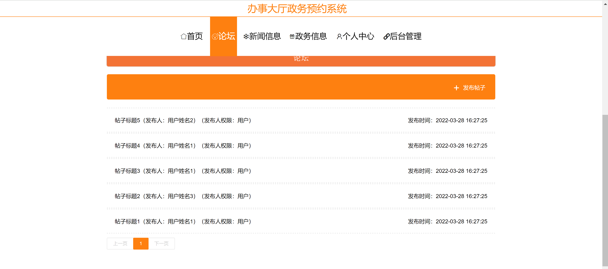
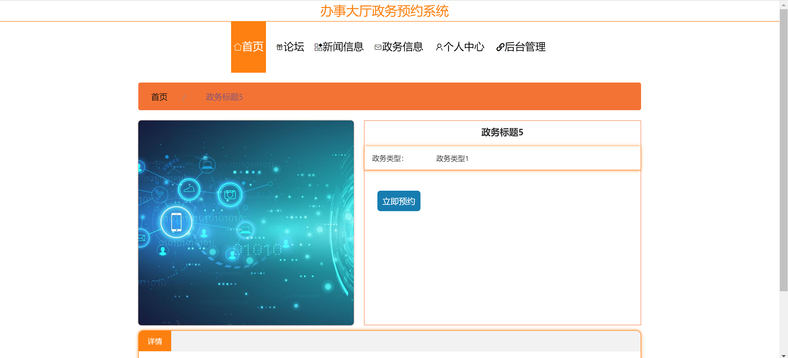
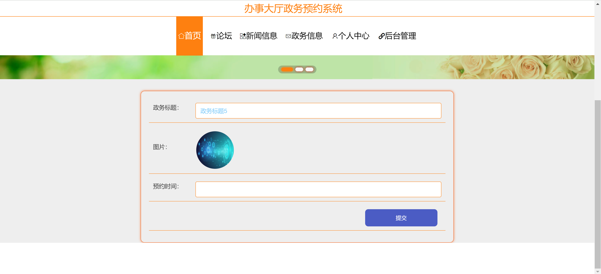
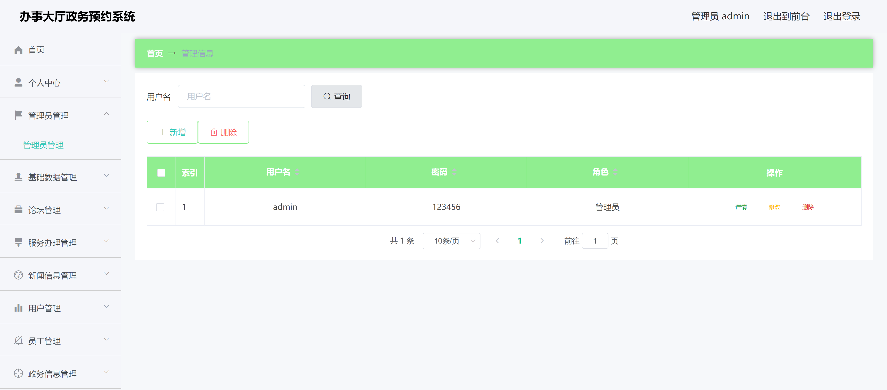
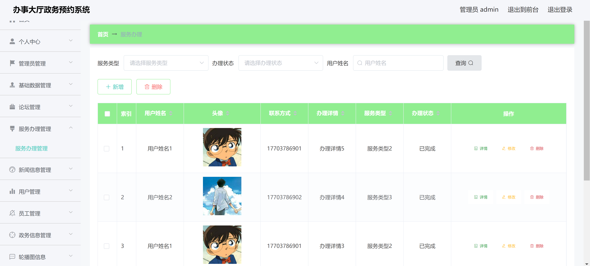
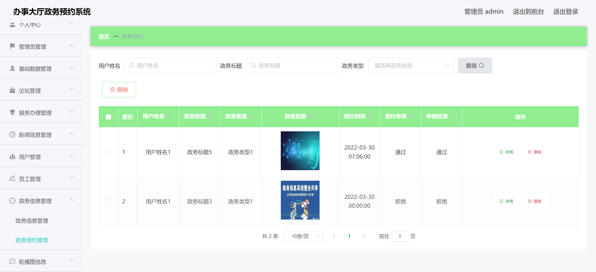

<h1 align="center">办事大厅预约管理系统</h1>

## 简介
办事大厅预约管理系统：角色分为管理员、用户；功能包括用户管理、论坛发布、新闻展示、政务预约、服务管理，简化流程，提高效率。    --计算机毕业设计源码；毕设源码；java毕业设计源码

## 联系方式

<h3 align="center">获取完整代码与数据库文件 + 微信：bysj5151 QQ: 86050149 QQ群: 783742310</h3>

<h3 align="center">可帮忙远程部署 包运行成功！提供远程部署、修改代码、设计文档指导、代码讲解等服务！</h3>

## 功能介绍（完整见运行截图）
管理员：基本功能包括登录、注册和退出，以及对用户信息的增删改查操作。系统支持管理员查看和管理预约信息、新闻信息和服务办理详情，提供角色管理和权限设置功能。此外，管理员可以访问后台管理模块，包括管理员管理、基础数据管理及论坛管理等。

用户：基本功能包含登录、注册和退出。用户可以查看和预约政务服务，填写并提交预约表单，还可以浏览新闻和论坛信息。系统允许用户通过个人中心查看和编辑个人信息，并管理预约记录。用户在论坛模块可以发布帖子和查看其他帖子，以便进行交流和互动。

## 运行截图

本代码来源于网络,仅供学习参考使用!

